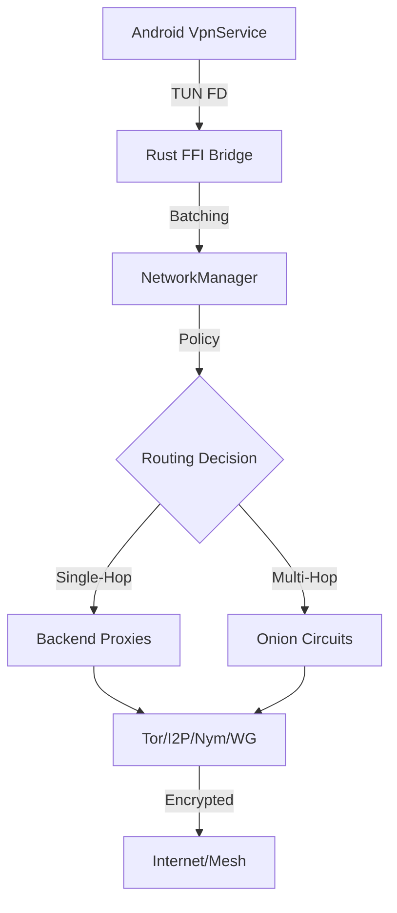

# 🛡️ VigilNet: The Obsidian Network

**VigilNet** is a state-of-the-art, privacy-hardened networking engine for Android and beyond. It combines multiple anonymity layers (Tor, I2P, Nym) with high-performance WireGuard tunneling and an offline mesh fallback into a single, cohesive "Obsidian" experience.

---

## 🚀 Key Capabilities

### 🌈 Multi-Backend Routing
Route your traffic through any combination of privacy networks, or chain them together for ultimate anonymity.
- **Onion Routing (Tor)**: Powered by the `arti` library for reliable, circuit-based anonymity.
- **Invisible Internet (I2P)**: Integrated SAM protocol for hidden service access.
- **Mixnet (Nym)**: Metadata-resistant mixnet routing for high-latency requirements.
- **Secure VPN (WireGuard)**: Zero-trust tunneling using the `boringtun` userspace implementation.
- **Decentralized Storage (Freenet)**: Fully P2P web content delivery.
- **Mesh Fallback**: BLE and Wi-Fi Direct gossip protocols for communication when the ISP fails.

### 💎 The Obsidian UI
Experience a premium, high-impact interface designed for clarity and elite status.
- **Glassmorphism**: Semi-transparent dashboards with neon status glows.
- **Live Heartbeat**: Pulsatile VPN status indicators that reflect real-time protection.
- **Multi-Hop Visualization**: Visual chain builder to trace your data from `App ➔ Tor ➔ WireGuard ➔ Internet`.

### ⚡ Extreme Performance
Optimized for the modern mobile processor.
- **Zero-Copy Pipeline**: Utilizes `bytes::Bytes` and JNI batching to achieve near-zero CPU overhead for packet processing.
- **Lockless Concurrency**: Routing decisions are made using `ArcSwap`, ensuring zero-contention even under heavy load.
- **Adaptive Batching**: Process up to 32 packets per JNI bridge call, minimizing context switching.

## 🔒 Security Hardening

- **Fail-Closed Strategy**: If source connectivity is lost, the tunnel remains active but sealed, ensuring no data leaks during network transitions.
- **Split-Tunneling**: Granular exclusion of apps and domains from the privacy tunnel.
- **DNS Leak Protection**: Intercepted DNS queries are resolved exclusively through the active privacy backend (TCP/Tor) to prevent ISP fingerprinting.
- **Precision Chains**: Custom routing policies per-app (e.g., Banking via Clearnet, Messaging via Tor).

---

## 🏗️ Architecture (Rust + Kotlin)



## 🛠️ Developer Setup

VigilNet is built with a modular Rust workspace and a Jetpack Compose Android frontend.

```bash
# 1. Build the Rust core for Android (aarch64)
./scripts/build_android.ps1

# 2. Open /android in Android Studio
# 3. Deploy to device (requires aarch64 support)
```

## 📂 Project Structure

- `crates/vigilnet-android`: JNI bindings and high-performance packet loop.
- `crates/vigilnet-tor`: Optimized Arti integration.
- `crates/vigilnet-wireguard`: Userspace BoringTun integration.
- `android/app`: The "Obsidian" Jetpack Compose frontend.

---

## 📜 License & Ethics

**VigilNet** is licensed under **GPL-3.0**. We believe in radical transparency and absolute privacy. 🕊️
